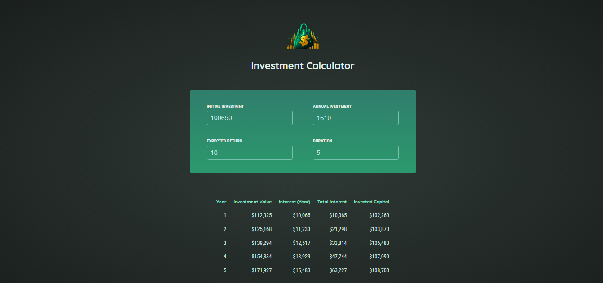

# Investment Calculator

[](https://react.dev/)


The Investment Calculator is a React application that helps users estimate the growth of their investments over a specified period. Users can input their initial investment, annual contributions, expected return rate, and duration to see a detailed year-by-year breakdown of their investment's performance.

## Project Overview



## Features

- User-friendly interface for inputting investment details.
- Dynamic calculations of investment growth, annual interest, and total interest.
- Validation to ensure realistic input values (e.g., valid duration).
- Detailed results table showing yearly projections.

## Project Structure

```
React-Investment-Calculator
│
│      .gitignore
│      .vite.config
│      index.html
│      package-lock.json
│      package.json
│      README.md
│
│
└───public
│   investment-calculator-logo.png
│   overView.png
│
└───src
    │   App.jsx
    │   index.jsx
    │   index.css
    │
    ├───assets
    │       investment-calculator-logo.png.svg
    │
    ├───components
    │   │
    │   │  Header.jsx
    │   │  Results.jsx
    │   │
    │   └───Inputs
    │       Input.jsx
    │       UserInput.jsx
    │
```

## Installation

To get started with the project locally:

1. Clone the repository:
   ```bash
   git clone https://github.com/SalahShallapy/React-Investment-Calculator
   ```
2. Navigate to the project directory:
   ```bash
   cd React-Investment-Calculator
   ```
3. Install dependencies:
   ```bash
   npm install
   ```
4. Run the project:

   ```bash
   npm run dev
   ```

   ## Usage

- Enter the Initial Investment, Annual Investment, Expected Return (%), and Duration (years) in the input fields.
- View the results displayed in a table, including:
  . Yearly investment values.
  . Annual and total interest earned.
  . Total invested capital.

  ## Contributing

  Contributions are what make the open source community such an amazing place to learn, inspire, and create. Any contributions you make are **greatly appreciated**.

  If you have a suggestion that would make this better, please fork the repo and create a pull request. You can also simply open an issue with the tag "enhancement".
  Don't forget to give the project a star! Thanks!

  1.  Fork the Project
  2.  Create your Feature Branch (`git checkout -b feature/AmazingFeature`)
  3.  Commit your Changes (`git commit -m 'Add some AmazingFeature'`)
  4.  Push to the Branch (`git push origin feature/AmazingFeature`)
  5.  Open a Pull Request

   <p align="right">(<a href="#top">back to top</a>)</p>
